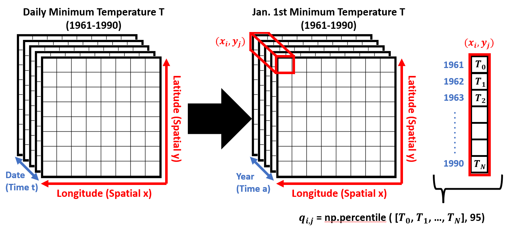
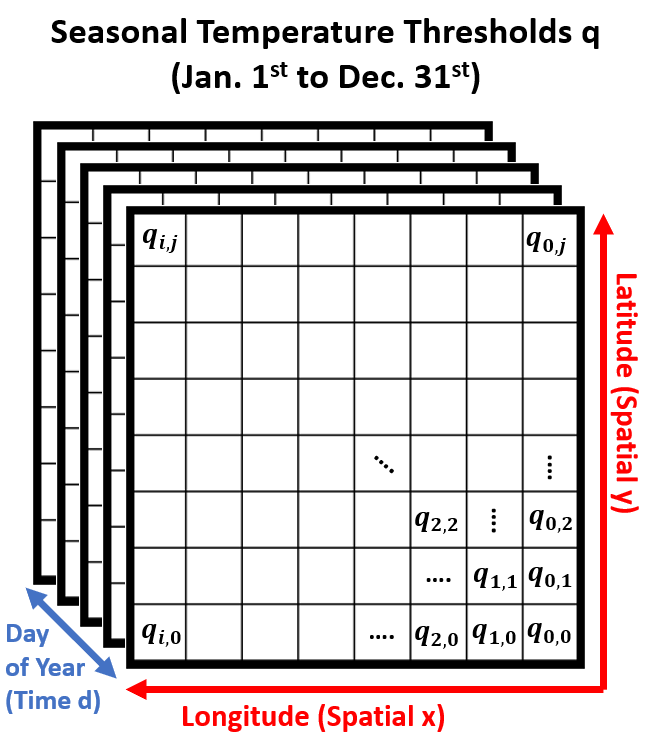

# Heatwave Threshold Methodology
This repository only features code and documentation relevant to the heatwave threshold component of the heatwave analysis package. A full overview of the package with all necessary scripts is available in the [main branch](https://github.com/AgentOxygen/heatwave_analysis_package).

A baseline daily temperature dataset is selected for defining the threshold of what daily temperature constitutes an "exceedingly hot day." The threshold is a seasonally measured percentile temperature from January 1st to December 31st for each location in the global grid, however we only use the warm seasons for computing the heatwave metrics (see the "Heatwave Days" section below). A series of schematics are provided to understand the process for computing the heatwave threshold data.

The baseline dataset should be a gridded timeseries of daily temperature data spanning at least 30 continuous years. For this experiment, we use the 1961 to 1990 ETCCDI baseline definition for extreme daily minimum temperature. The data's array should be described by date timestamps (time t), latitudinal coordinates (spatial y), and longitudinal coordinates (spatial x). To compute a seasonal threshold, we need to analyze each day of the year (that is, one of the 365 days of the year) separately. The schematic above shows how we obtain the January 1st daily minimum temperatures for each year from 1961 to 1990 (reducing the time dimension from 10950 lat./lon. grids to 30 lat./lon. grids). The 95th percentile temperature (q) for each grid cell's annual timeseries is then computed with the numpy function call. The percentile computed is arbitrary, but we chose 95th for this experiment. This produces the dataset structure shown below:

The resulting threshold dataset has the same spatial dimensions as the original data. The time dimension has units "day of year," referring to each day in the 365 calendar year (Jan 1st, Jan 2nd, etc.). The resulting time dimension for the threshold dataset has a length of 365. Note that this value may need to change depending on what calendar the baseline data uses (our experiment uses the 365 noleap calendar).

## Test Case
The sample datasets in `/test` are provided for prototyping purposes. Overviews of the datasets are presented in `TestDataOverview.ipynb`. The input temperature dataset is CESM2 projected daily minimum temperatures from 2015 to 2023 in a 8 by 17 lat./lon. grid over Southern Texas under SSP3-7.0 conditions.

Scaling might be an issue, so global sample (192 by 288 grid) inputs/outputs from are available in a public [UT Box directory](https://utexas.box.com/s/mb8fbcyld8mows6sc7svl3biu1q0qwpa). 