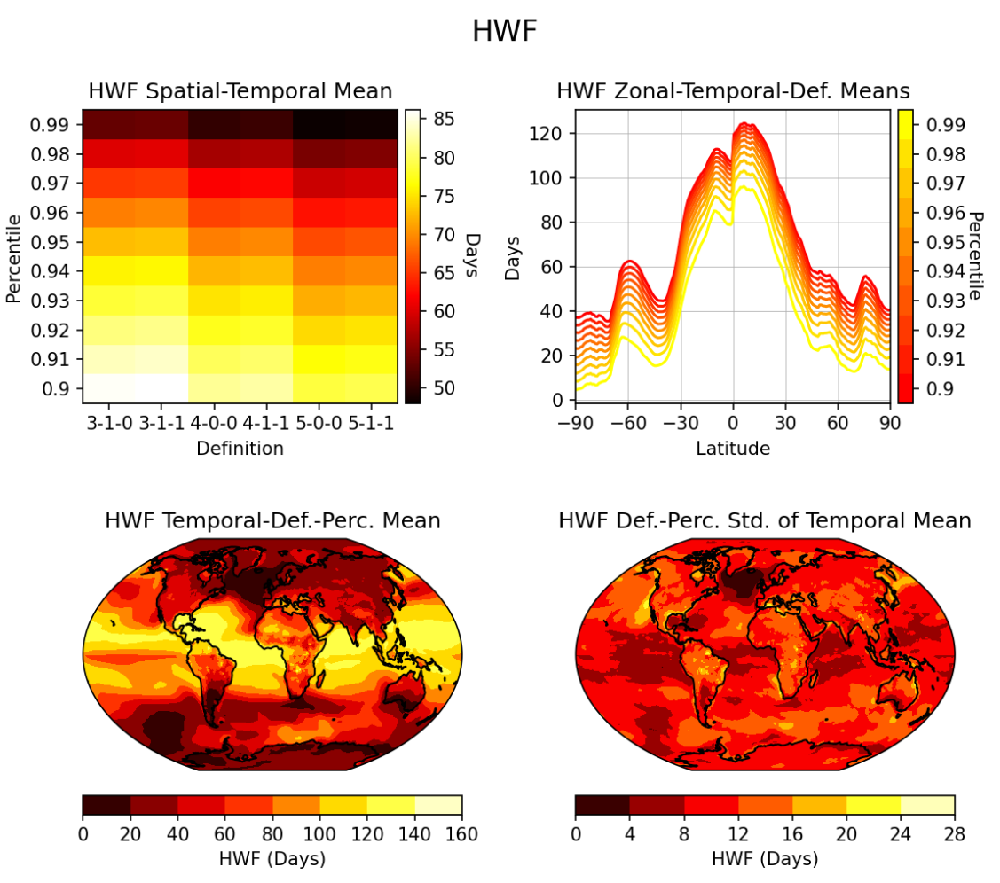

Examples
========

.. _quickstart_walkthrough:
Example: Quick Start Walkthrough
------------------------------------------
In this section, we will step through each line of the :ref:`Quick Start <quickstart>` code snippet. This example can be completely reproduced using tools installed with the HDP, no extra downloads required!

First, we need a baseline temperature dataset to derive the threshold from and a test datasets to compare against. For unit testing, the HDP includes utility functions ``hdp.utils.generate_test_control_dataarray`` and ``hdp.utils.generate_test_warming_dataarray`` for generating mock datasets.

.. code-block:: python

    import hdp

    sample_control_temp = hdp.utils.generate_test_control_dataarray(add_noise=True)
    sample_warming_temp = hdp.utils.generate_test_warming_dataarray(add_noise=True)

The sample control temperatures are generated using the following equation over a time series :math:`t`:

.. math::

    y_1(t) = 20 + 2\sin{\left(2\pi \left(\frac{\beta + t}{365}\right)\right)}

Where :math:`\beta = 270` for the Northern hemisphere and :math:`\beta = 90` for the Southern hemisphere. A latitudinal gradient is then applied for latitudes :math:`l`

.. math::
    y_2(t) = y_1 - 10\frac{|l|}{90}

This essentially simulates a seasonally-varying temperature pattern that decreases with latititude. Optionally, a random noise filter can be applied to create variance across multiple definitions and pecentiles. 

Before we can use the data with HDP functions, we must format the measures to convert units and variable names if necessary:

.. code-block:: python

    baseline_measures = hdp.measure.format_standard_measures(
        temp_datasets=[sample_control_temp]
    )
    test_measures = hdp.measure.format_standard_measures(
        temp_datasets=[sample_warming_temp]
    )

Next, we define the range of percentiles to sample over and then derive the thresholds from the baseline (control) dataset:

.. code-block:: python

    import numpy as np

    percentiles = np.arange(0.9, 1.0, 0.01)

    thresholds_dataset = hdp.threshold.compute_thresholds(
        baseline_measures,
        percentiles
    )

Once we have a threshold, we can specify the heatwave definitions to sample and then calculate the heatwave metrics across all thresholds and definitions.  The heatwave definitions are defined as integer sequences that describe the following criteria (in order of integer placement):

#. The minimum number of hot days to start a heatwave event.
#. The maximum number of non-hot days that can follow the start of a heatwave event (creating a small break).
#. The maximum number of subsequent events that can come after the break (and be considered part of the starting heatwave).

The definition codes may feel confusing at first, but they allow the user to capture many different "types" of heatwave and derive additional heatwave metrics without having to repeat the computationally-expensive analysis:

.. code-block:: python

    definitions = [[3,0,0], [3,1,1], [4,0,0], [4,1,1], [5,0,0], [5,1,1]]

    metrics_dataset = hdp.metric.compute_group_metrics(test_measures, thresholds_dataset, definitions, include_threshold=True)

By setting ``include_threshold=True``, we ensure the output dataset stored in ``metrics_dataset`` contains the threshold dataset as well. This can result in very large arrays for larger datasets (particularly large ensmebles), so this is an optional parameter.

The output is a standard ``xarray.Dataset``, so we can save as a netCDF file just as any other ``xarray.Dataset``:

.. code-block:: python

    output_dir = "."
    metrics_dataset.to_netcdf(f"{output_dir}/sample_hw_metrics.nc", mode='w')

Similary, the input datasets (control and warming) are ``xarray.DataArray`` which can be converted ``xarray.Dataset`` to save these as netCDF files for further inspection:

.. code-block:: python

    sample_control_temp = sample_control_temp.to_dataset()
    sample_control_temp.attrs["description"] = "Mock control temperature dataset generated by HDP for unit testing."
    sample_control_temp.to_netcdf(f"{output_dir}/sample_control_temp.nc", mode='w')

    sample_warming_temp = sample_warming_temp.to_dataset()
    sample_warming_temp.attrs["description"] = "Mock temperature dataset with warming trend generated by HDP for unit testing."

Finally, we can generate a figure deck for this dataset and save the resulting summary figures to a notebook:

.. code-block:: python

    figure_notebook = create_notebook(metrics_dataset)
    figure_notebook.save_notebook(f"{output_dir}/sample_hw_summary_figures.ipynb")

Example: Analyzing CESM2 Dataset hosted in the Cloud
------------------------------------------
In this example, we will analyze real datasets produced by a climate model, specifically the Community Earth System Model v2 (CESM2), as part of the Coupled Model Intercomparison Project Phase 6 (CMIP6). The data is hosted in an `AWS S3 bucket managed by ESGF and Pangeo <https://registry.opendata.aws/cmip6/>`_.

The full workflow code is available in `docs/example_cmip_workflow/run_cmip_workflow.py` and can be executed using the docker container described, see :ref:`docker_setup`. This example has been reduced in scale to execute on a standard desktop PC setup. Testing was conducted on a AMD Ryzen 7 5800X with 32 GB of DDR4 RAM and took 18 minutes of runtime. Total runtime will vary based on hardware and network connectivity.

.. list-table:: CESM2 Example Parameter Space
   :widths: 50 50
   :header-rows: 1

   * - Parameter
     - Range/Values
   * - Measures
     - tas
   * - Thresholds
     - [0.9, 0.91, ... 0.99]
   * - Definitions
     - 3-1-0, 3-1-1, 4-0-0, 4-1-1, 5-0-0, 5-1-1

To fully utilize the performance enhancments offered by the HDP, we must first start a `Dask cluster <https://docs.dask.org/en/stable/deploying.html>`_ to leverage parallel computation. This step is not automated because it requires system-specific configuration. If you are working on a single, local machine, a `LocalCluster <https://docs.dask.org/en/stable/deploying.html#local-machine>`_ typically works best. However, if you are working on a distributed system at a supercomputing center, use the Dask configuration reccomended by your trusted HPC specialist.

.. code-block:: python

    from dask.distributed import Client, LocalCluster

    cluster = LocalCluster(n_workers=6, memory_limit="16GB", threads_per_worker=2, processes=True)
    client = Client(cluster)

We can then index the S3 bucket and isolate our analysis to a single ensemble member:

.. code-block:: python

    import pandas as pd

    aws_cmip_index = pd.read_csv("https://cmip6-pds.s3.amazonaws.com/pangeo-cmip6.csv")
    cesm_index = aws_cmip_index.query("table_id=='day' & source_id=='CESM2'")
    cesm_index = cesm_index[cesm_index["member_id"] == 'r4i1p1f1']

To simplify the calculation, we will further reduce the scope by focusing on a single scenario, namely SSP3-7.0, and use a single historical simulation as our baseline.

.. code-block:: python

    ssp370_tas_info = cesm_index.query("experiment_id=='ssp370' & variable_id=='tas'")
    baseline_tas_info = cesm_index.query("experiment_id=='historical' & variable_id=='tas'")

To access the cloud-based dataset, we need to use the `s3fs` Python package:

.. code-block:: python

    fs = s3fs.S3FileSystem(anon=True)

We can then access the file system using xarray:

.. code-block:: python

    ssp370_tas = xr.open_zarr(fs.get_mapper(ssp370_tas_info["zstore"].iloc[0]), consolidated=True)["tas"]
    baseline_tas = xr.open_zarr(fs.get_mapper(baseline_tas_info["zstore"].iloc[0]), consolidated=True)["tas"]

The data is chunked for optimal cloud-based storage, but is not ideal for both HDP calculation (time needs to be one continuous chunk due to the indexing algorithm) and our memory limit of 16 gigabytes. To remedy this, we rechunk to a continuous time dimension and instead chunk over space. Additionally, we reduce the historical period from the original 1850 to 2014 run to a shorter 30-year period of 1961 to 1990 (this will significantly reduce the computational burden of the threshold calculation):

.. code-block:: python

    ssp370_tas = ssp370_tas.chunk(dict(time=-1, lat=24, lon=18))
    baseline_tas = baseline_tas.chunk(dict(time=-1, lat=24, lon=18)).sel(time=slice("1961-01-01", "1990-12-31"))

We can then format the measure for use by the HDP and then calculate the thresholds and metrics as demonstrated in the :ref:`Quick Start guide <quickstart>`.

.. code-block:: python

    baseline_measures = hdp.measure.format_standard_measures(temp_datasets=[baseline_tas])
    ssp370_measures = hdp.measure.format_standard_measures(temp_datasets=[ssp370_tas])

    percentiles = np.arange(0.9, 1.0, 0.01)
    thresholds = hdp.threshold.compute_thresholds(
        baseline_measures,
        percentiles
    )

    definitions = [[3,1,0], [3,1,1], [4,0,0], [4,1,1], [5,0,0], [5,1,1]]
    metrics_dataset = hdp.metric.compute_group_metrics(ssp370_measures, thresholds, definitions)

    metrics_dataset.to_zarr("cesm2_ssp370_hw_metrics.zarr", mode='w', compute=True, zarr_format=2)

To avoid re-computing the dataset, we can update `metrics_dataset` to use the local zarr store we just created and then compute the figure deck:

.. code-block:: python

    figure_notebook = create_notebook(metrics_dataset_disk)
    figure_notebook.save_notebook("cesm2_ssp370_hw_metrics.ipynb")

    # Good practice to shutdown the Dask cluster when done.
    client.shutdown()

Below is one of the figures produced by the figure deck, showing heatwave frequency (HWF) derived from average temperature (tas) for SSP3-7.0 of CESM2 CMIP6 ensemble member `r4i1p1f1`.

