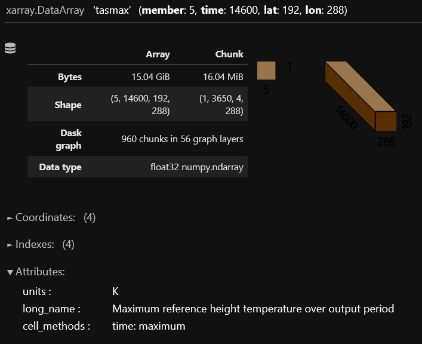
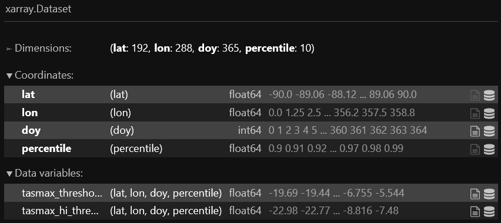
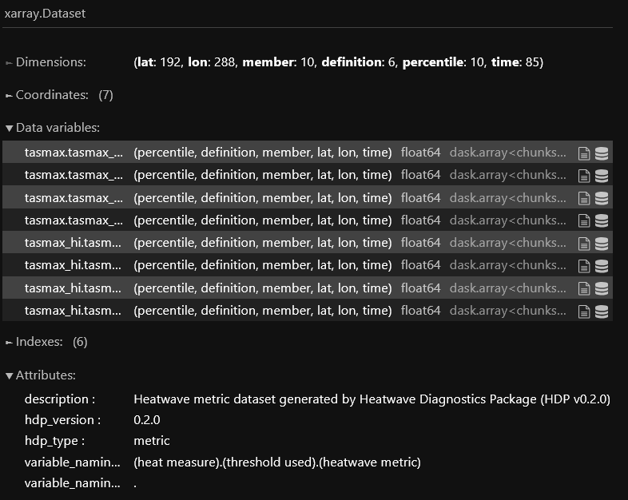

User Guide
=====

What is the HDP?
----------------
The Heatwave Diagnostics Package (HDP) is a collection of Python tools for computing heatwave metrics and generating summary figures. Functions can be imported in Jupyter notebooks and Python scripts or called in the terminal using the command line interface (CLI). All data uses `xarray <https://docs.xarray.dev/en/stable/>`_ data structures and can be saved to disk as either Zarr stores (default) or netCDF datasets. Summary figures can be generated to describe the output and can be saved to disk in Jupyter notebooks.

The HDP workflow follows three steps:

1. Format both a baseline and test measure of heat

2. Generate an extreme heat threshold from the baseline

3. Compute heatwave metrics by comparing the test measure against the baseline threshold

Throughout this guide, "baseline" refers to a measure of heat that is used to generate the threshold values from. Threshold values are defined as a percentile of all baseline values for each day of the year (see :ref:`Threshold Calculation <threshold_calc>` for more details). The "test" measure is compared against the threshold values to calculate hot days (days that exceed the threshold). Finally, the "heatwave definition" refers to an integer-sequence that describes what patterns of hot days over time are considered heatwaves. The span of different measures, thresholds, and definitions defines the "heatwave parameter space."

Statement of Need
-----------------
Existing tools used to quantify heatwave metrics (such as `ehfheatwaves <http://tammasloughran.github.io/ehfheatwaves/>`_, `heatwave3 <https://robwschlegel.github.io/heatwave3/index.html>`_, `nctoolkit <https://nctoolkit.readthedocs.io/en/latest/>`_) were not designed to sample large sections of the heatwave parameter space. Many of these tools struggle to handle the computational burden of analyzing terabyte-scale datasets and do not offer a complete workflow for generating heatwave diagnostics from daily, gridded climate model output. The HDP expands upon this work to empower the user to conduct parameter-sampling analysis and reduce the computational burden of calculating heatwave metrics from increasingly large model output.

Installation
------------
The HDP can be installed using PyPI. You can view the webpage `here <https://pypi.org/project/HDP-python/>`_.

.. code-block:: console

   $ pip install hdp-python

Quick Start
-----------
Below is example code that computes heatwave metrics for multiple measures, thresholds, and definitions from sample data generated by the HDP. Heatwave metrics are obtained for the "warming" data by comparing against the thresholds generated from the "control" data.

.. code-block:: python

    import hdp
    
    output_dir = "."

    sample_control_temp = hdp.utils.generate_test_control_dataarray()
    sample_warming_temp = hdp.utils.generate_test_warming_dataarray()

    baseline_measures = hdp.measure.format_standard_measures(
        temp_datasets=[sample_control_temp]
    )
    test_measures = hdp.measure.format_standard_measures(
        temp_datasets=[sample_warming_temp]
    )

    percentiles = np.arange(0.9, 1.0, 0.01)

    thresholds_dataset = hdp.threshold.compute_thresholds(
        baseline_measures,
        percentiles
    )

    definitions = [[3,0,0], [3,1,1], [4,0,0], [4,1,1], [5,0,0], [5,1,1]]

    metrics_dataset = hdp.metric.compute_group_metrics(test_measures, thresholds_dataset, definitions, include_threshold=True)
    metrics_dataset.to_netcdf(f"{output_dir}/sample_hw_metrics.nc", mode='w')

    figure_notebook = create_notebook(metrics_dataset)
    figure_notebook.save_notebook(f"{output_dir}/sample_hw_summary_figures.ipynb")

    sample_control_temp = sample_control_temp.to_dataset()
    sample_control_temp.attrs["description"] = "Mock control temperature dataset generated by HDP for unit testing."
    sample_control_temp.to_netcdf(f"{output_dir}/sample_control_temp.nc", mode='w')

    sample_warming_temp = sample_warming_temp.to_dataset()
    sample_warming_temp.attrs["description"] = "Mock temperature dataset with warming trend generated by HDP for unit testing."
    sample_warming_temp.to_netcdf(f"{output_dir}/sample_warming_temp.nc", mode='w')

This code snippet is included in the HDP source code and can be executed via:

.. code-block:: console

   $ git clone https://github.com/AgentOxygen/HDP.git
   $ cd HDP
   $ python hdp/docs/sample_data/sample.py hdp/docs/sample_data/

The sample data, metric data, and summary figures are all saved to the specified `hdp/docs/sample_data/` but this path can be changed as needed. The sample input data is the same data used in unit testing, where temperature is generated using a sine wave over time with a period of one year and a gradient is applied to decrease the temperature uniformly over latitude. This processes is encapsulated in the function `hdp.utils.generate_test_control_dataarray`. For the warming dataset, a slight warming trend is applied uniformly over time to simulate global warming. By generating these input datasets instead of supplying them directly, we reduce disk space needed to install/use the package with sample data included.

Example: Generating Heatwave Diagnostics
------------------------------------------
In this first example, we will produce heatwave metrics for one IPCC AR6 emission scenario, SSP3-7.0, run by the CESM2 climate model to produce a large ensemble called the "CESM2 Large Ensemble Community Project" or `LENS2 <https://www.cesm.ucar.edu/community-projects/lens2>`_. We will explore the following set of heatwave parameters:

.. list-table:: Example 1 Parameter Space
   :widths: 50 50
   :header-rows: 1

   * - Parameter
     - Range/Values
   * - Measures
     - tas, tasmax, tas_hi, tasmax_hi,
   * - Thresholds
     - [0.9, 0.91, ... 0.99]
   * - Definitions
     - 3-1-0, 3-1-1, 4-0-0, 4-1-1, 5-0-0, 5-1-1

Note that "_hi" refers to the heat index values for those variables. The model does not explicitly output heat index measurements, but we can calculate them from relative humidity (rh) using the HDP. For the thresholds, we select the range of percentiles from 0.9 to 0.99 with steps of 0.01. The heatwave definitions are defined as integer sequences that describe the following criteria (in order of integer placement):

#. The minimum number of hot days to start a heatwave event.
#. The maximum number of non-hot days that can follow the start of a heatwave event (creating a small break).
#. The maximum number of subsequent events that can come after the break (and be considered part of the starting heatwave).

The definition codes may feel confusing at first, but they allow the user to capture many different "types" of heatwave and derive additional heatwave metrics without having to repeat the computationally-expensive analysis. We will investigate an example of derived metrics at the end of this section.

To fully utilize the performance enhancments offered by the HDP, we must first start up a `Dask cluster <https://docs.dask.org/en/stable/deploying.html>`_ to leverage parallel computation. This step is not automated because it requires system-specific configuration. If you are working on a single, local machine, a `LocalCluster <https://docs.dask.org/en/stable/deploying.html#local-machine>`_ typically works best. However, if you are working on a distributed system at a supercomputing center, use the Dask configuration reccomended by your trusted HPC specialist. Below is an example configuration for use on a single-node with at least 30 cores and 200 (20x10 GB) of memory:

.. code-block:: python

    from dask.distributed import Client, LocalCluster
    cluster = LocalCluster(n_workers=20, memory_limit="10GB", threads_per_worker=1, processes=True)
    client = Client(cluster)

Once a Dask cluster is initialized, we then need to organize our data into `xarray.DataArray <https://docs.xarray.dev/en/stable/generated/xarray.DataArray.html>`_ objects. The entire HDP is built around xarray data structures to ensure ease of use and remain agnostic to input file types. Since we are working with a large ensemble, we need to make sure to concatenate the ensemble members along a "member" dimension. If we weren't using a large ensemble (a single long-running simulation for example), we would just omit this step. To read data from disk, we can use the `xarray.open_mfdataset <https://docs.xarray.dev/en/stable/generated/xarray.open_mfdataset.html>`_ function. Reading and post-processing data will look different from system to system, but the final format should be the same. Below is a list of `xarray.DataArrays` with the data structure for `baseline_tasmax` dataset visualized below:

.. code-block:: python

    baseline_tasmax
    baseline_rh
    ssp370_tasmax
    ssp370_rh
    
    baseline_tasmax

The spatial coordinates for latitude and longitude should be named "lat" and "lon" respectively. The "time" coordinates should be decoded into `CFTime`` objects and a "member" dimension should be created if an ensemble is being used.

To begin, we first need to format these measures so that they are in the correct units. This process will also compute heat index values using the relative humidity (rh) datasets.

.. code-block:: python

    baseline_measures = hdp.measure.format_standard_measures(temp_datasets=[baseline_tasmax], rh=baseline_rh)
    ssp370_measures = hdp.measure.format_standard_measures(temp_datasets=[ssp370_tasmax], rh=ssp370_rh)

Now we can generate our range of thresholds from the baseline measures:

.. code-block:: python

    percentiles = np.arange(0.9, 1.0, 0.01)
    thresholds = hdp.threshold.compute_thresholds(
        baseline_measures,
        percentiles
    )

The DataArray structure is visualized below:

Next we can compute the heatwave metrics by comparing the SSP3-7.0 measures against the thresholds we generated from the baseline temperatures, using the definitions we defined earlier:

.. code-block:: python

    definitions = [[3,1,0], [3,1,1], [4,0,0], [4,1,1], [5,0,0], [5,1,1]]
    metrics_dataset = hdp.metric.compute_group_metrics(test_measures, thresholds_dataset, definitions)

The metrics Dataset structure is visualized below:

Since we are connected to a Dask cluster, we can write the output to a zarr store in parallel. This finishes the data-generation portion of the HDP workflow and saves the results to disk for easier access in the future (otherwise we would need to rerun this heavy computation every time we wanted metrics):

.. code-block:: python

    metrics_dataset.to_zarr("lens2_ssp370_hw_metrics.zarr", mode='w', compute=True)

